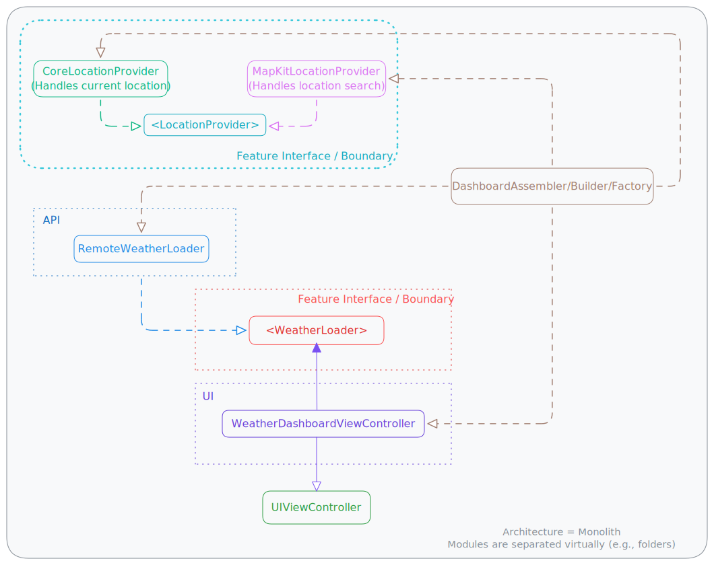

<p align="center">
    
</p>

# Maeve

A cute little side project I’m building in public. Will (eventually) be a simple iOS weather
app that provides the high low, and current temperature for the day, perhaps with some fun
additional little features, as inspiration strikes.

- [📸 Gallery](#-gallery)
  - [👋🏼 Hello World!](#-hello-world)
- [📆 Up Next…](#-up-next)
- [🤝🏼 How You can Contribute to this Project](#-how-you-can-contribute-to-this-project)

## Weather Dashboard Feature

### Story: User requests to see the weather dashboard

#### Narrative #1

```
As a user
I want the app to load the dashboard
So that I can see the dashboard
```

#### Scenario (Acceptance Criteria)

```
Given a user
When the user opens the dashboard
Then the dashboard is displayed
```

## Architecture

This is a module-level abstraction of the dependency graph for Maeve. For now, I can separate
concerns using folders as "virtual modules." This gives me something to aim at!



## Gallery

### 👋🏼 Hello World!


## 📆 Up Next…

- [ ] Start tracking a dependency diagram for this project to inform architecture choices
- [ ] Display the high and low temperature using a free (preferably open-source) weather API
- [ ] Stop just goofing around and finally set up tests and CI for things

## 🤝🏼 How You can Contribute to this Project

For details on how to contribute to this project, see [CONTRIBUTING.md](./CONTRIBUTING.md#getting-started).
