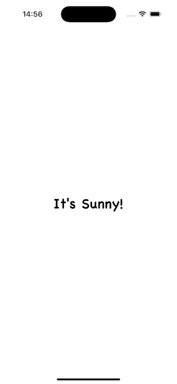

<p align="center">
    
</p>

# Maeve

A cute little side project I’m building in public. Will (eventually) be a simple iOS weather
app that provides the high low, and current temperature for the day, perhaps with some fun
additional little features, as inspiration strikes.

- [📸 Gallery](#-gallery)
  - [👋🏼 Hello World!](#-hello-world)
- [📆 Up Next…](#-up-next)
- [🤝🏼 How You can Contribute to this Project](#-how-you-can-contribute-to-this-project)

## Weather Dashboard Feature

### Story: Customer requests to see their weather dashboard

#### Narrative #1

```
As an online customer
I want the app to automatically load the latest weather on my dashboard based on my currently detected location
So that I can quickly see the latest temperature reading without manually entering my location
```

#### Scenario (Acceptance Criteria)

```
Given the customer has connectivity
  And the customer has location services enabled
 When the customer requests to see their weather dashboard
 Then the app should display the latest weather for that location from (remote)
```

## Architecture

This is a module-level abstraction of the dependency graph for Maeve. For now, I can separate
concerns using folders as "virtual modules." This gives me something to aim at!


## Gallery

### 👋🏼 Hello World!



## 📆 Up Next…

- [ ] Start tracking a dependency diagram for this project to inform architecture choices
- [ ] Display the high and low temperature using a free (preferably open-source) weather API
- [ ] Stop just goofing around and finally set up tests and CI for things

## 🤝🏼 How You can Contribute to this Project

For details on how to contribute to this project, see [CONTRIBUTING.md](./CONTRIBUTING.md#getting-started).
