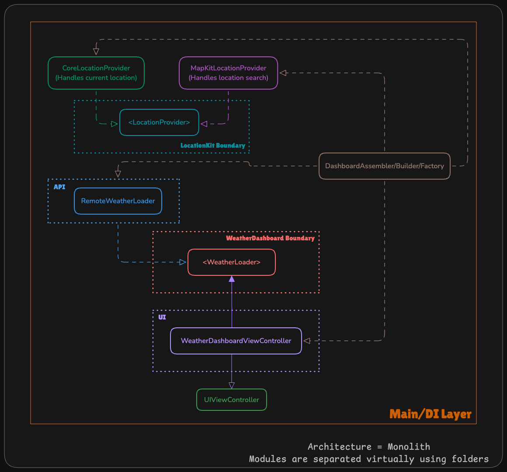

<p align="center">
    
</p>

# Maeve

A cute little side project I’m building in public. Will (eventually) be a simple iOS weather
app that provides the high low, and current temperature for the day, perhaps with some fun
additional little features, as inspiration strikes.

- [Weather Dashboard Features](#weather-dashboard-feature)
  - [Story: Customer requests to see their weather dashboard](#story-customer-requests-to-see-their-weather-dashboard)
- [Use Cases](#use-cases)
  - [Load Weather From Remote Use Case](#load-weather-from-remote-use-case)
- [→ Flow Chart](#-flow-chart)
- [⛅ Weather Dashboard Model Specs](#-weather-dashboard-model-specs)
  - [📦 Payload/API Contract](#-payload-contract)
- [📐 Architecture](#-architecture)
- [📸 Gallery](#-gallery)
  - [👋🏼 Hello World!](#-hello-world)
- [📆 Up Next…](#-up-next)
- [🤝🏼 How You can Contribute to this Project](#-how-you-can-contribute-to-this-project)

## Weather Dashboard Feature

### Story: Customer requests to see their weather dashboard

#### Narrative #1

```
As an online customer
I want the app to automatically load the latest weather on my dashboard based on my currently detected location
So that I can quickly see the latest temperature reading without manually entering my location
```

#### Scenario (Acceptance Criteria)

```
Given the customer has connectivity
  And the customer has location services enabled
 When the customer requests to see their weather dashboard
 Then the app should display the latest weather for that location from (remote)
```

```
Given the customer has connectivity
  But the customer doesn't have location services enabled
 When the customer requests to see their weather dashboard
 Then the app should display a "location services disabled" error message
```

## Use Cases

### Load Weather From Remote Use Case

#### Data:

- URL
- Longitude and Latitude coordinates

#### Primary Course (happy path):

1. Execute "Load Weather Dashboard" command with above data.
1. System downloads data from the URL using the longitude and latitude.
1. System validates downloaded data.
1. System generates a weather dashboard from validated data.
1. System delivers weather dashboard.

#### Location services disabled - error course (sad path):

1. System requests location permissions from OS.

#### Invalid Data - error course (sad path):

1. System delivers invalid data error.

#### No connectivity - error course (sad path):

1. System delivers connectivity error.

## → Flow Chart


## ⛅ Weather Dashboard Model Specs

### Weather Data

The model name is `WeatherData` and it's fetched using the `WeatherLoader` protocol.

Here are my intended properties for **`WeatherData`**:

| Property         | Type                    |
| ---------------- | ----------------------- |
| `id`             | `UUID`                  |
| `location`       | `String`                |
| `description`    | `String`                |
| `temperature`    | `Double`                |
| `minTemperature` | `Double`                |
| `maxTemperature` | `Double`                |
| `created`        | `Date` (ISO8601 String) |
| `iconURL`        | `URL`                   |

### Current API

- [Weather API - OpenWeatherMap](https://openweathermap.org/api)

> \[!IMPORTANT\]\
> The design should enable easy replacement of this API with another in the future.

### Example API Request to OpenWeatherMap

`https://api.openweathermap.org/data/2.5/weather?lat=40.292629&lon=-111.744766&appid={API_KEY}`

```bash
curl -X GET "https://api.openweathermap.org/data/2.5/weather?lat=40.7128&lon=-74.006&appid=xxx000xxx000xxx000xxx000xxx000xx"
```

#### Inputs

- **Latitude**: `-90.0` to `90.0`
- **Longitude**: `180.0` to `180.0`
- **API Key**: `unique_api_key` (retrieved from https://home.openweathermap.org/api_keys)

### 📦 Payload Contract

> **Note:** values that are not quoted are numbers.

```
GET /weather?lat={LATITUDE}&long={LONGITUDE}&appid={API_KEY}

200 RESPONSE

{
  "coord": {
    "lon": longitude of the location (signed),
    "lat": latitude of the location (signed)
  },
  "weather": [
    {
      "id": weather condition id,
      "main": "a group of weather parameters",
      "description": "the weather condition within the group",
      "icon": "the weather icon id"
    }
  ],
  "base": "internal parameter",
  "main": {
    "temp": temperature (Default: K, Metric: C°, Imperial: F°),
    "feels_like": the human perception of the temperature in (Default: K, Metric: C°, Imperial: F°),
    "temp_min": minimum daily temperature (Default: K, Metric: C°, Imperial: F°),
    "temp_max": maximum daily temperature (Default: K, Metric: C°, Imperial: F°),
    "pressure": atmospheric pressure at sea level (hPa),
    "humidity": humidity (%),
    "sea_level": atmospheric pressure at sea level (hPa),
    "grnd_level": atmospheric pressure on the ground level (hPa)
  },
  "visibility": average visibility (metres, max = 10 km),
  "wind": {
    "speed": wind speed (default: m/s, metric: m/s, imperial: mph),
    "deg": wind direction (degrees: meteorological),
    "gust": wind gust (default: m/s, metric: m/s, imperial: mph)
  },
  "clouds": {
    "all": cloudiness (%)
  },
  "dt": time of data calculation (unix, UTC),
  "rain": {
    "1h": Precipitation (mm/h)
  },
  "snow": {
    "1h": Precipitation (mm/h)
  },
  "sys": {
    "type": internal parameter (unsigned),
    "id": internal parameter (unsigned),
    "country": "Country Code (GB, JP etc.)",
    "sunrise": sunrise time (unix, UTC),
    "sunset": sunset time (Unix, UTC)
  },
  "timezone": shift in seconds from UTC (signed),
  "id": City ID,
  "name": "City name",
  "cod": internal parameter (unsigned)
}

// Rain and snow may or may not be included depending on if they are available (optional).

{
  ...
  "rain": {
    "1h": Precipitation (mm/h)
  },
  ...
}
{
  ...
  "snow": {
    "1h": Precipitation (mm/h)
  },
}
{
  ...
  ...
}
```

## 📐 Architecture



This is a module-level abstraction of the dependency graph for Maeve. For now, I can separate
concerns using folders as "virtual modules." Eventually, modules will be injected at the
Main/App/DI Layer.

This is good enough for now and gives me something to aim at!

## 📸 Gallery

### 👋🏼 Hello World!


## 📆 Up Next…

- [x] Start tracking a dependency diagram for this project to inform architecture choices
- [ ] Display the high and low temperature using a free (preferably open-source) weather API
- [ ] Stop just goofing around and finally set up tests and CI for things

## 🤝🏼 How You can Contribute to this Project

For details on how to contribute to this project, see [CONTRIBUTING.md](./CONTRIBUTING.md#getting-started).
